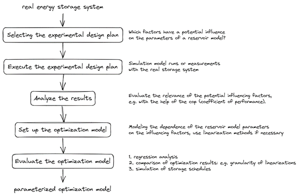

## Overview

The toolchain consists of 5 steps, which are shown in the figure below:

Starting with a real energy storage system, a [experimental design plan is established](#selecting-the-experimental-design) is which comprises of potential influencing factors on the parameters of a reservoir model. In the next step, the [experimental design plan is executed](#execute-the-experimental-design) and then [the results are evaluated](#analyze-the-results) using a metamodel in order to identify the significant influencing factors. In the fourth step, the equations for the [optimization model](#set-up-the-optimization-model) are set up based on these results and parameterized according to the results of the test plan. In the fifth step, the [quality of the optimization model is analyzed](#evaluate-the-optimization-model) using three different approaches - using regression analysis, by comparing the optimization results of different modeling variants and by comparing the optimization results with the real behavior of the storage system.

## Selecting the experimental design

> **Summary**
> - Efficiencies are essential parameters of Level 1 reservoir models
> - These efficiencies can have dependencies on other parameters or variables
> - Design of experiments can be used to investigate the influence of different variables on these efficiencies

Reservoir models are characterized by efficiencies. Depending on the type of energy storage system, these efficiencies depend on other parameters, such as humidity, or variables, such as the current storage power. With the help of Design of Experiments (DoE), these influencing factors can be systematically captured and examined regarding their influence on the overall behavior of the storage system.

Establishing an experimental design allows a series of representative computational experiments to be carried out in order to perform a uniform investigation of the entire experimental space. For this purpose, influencing variables on the parameters to be investigated (usually efficiencies) are first determined and then plausible factor limits are set for these. A basic understanding of the storage technology and its potential behavior is recommended to determine the influencing variables and the factor limits.

The DoE determines a reasonable combination of sample size and factor variation to facilitate distinguishing between real and apparent effects. Within the experimental design, the values of the factors are varied within their limits. These varying values between the factor boundaries are called levels. A prerequisite for the experimental design is that the combinations of the different factors are not mutually exclusive. The use of an experimental design allows the efficient investigation of the storage behavior with optimal factor combinations while minimizing the number of experiments and calculations to be carried out.

There are different ways of setting up experimental plans - in this project the Advanced Latin Hypercube (ALHC) method was used. This sampling approach minimizes correlation errors due to stochastic evolution strategies and is recommended for experimental designs with fewer than 50 factors. Using the ALHC, the distributions of the factors are generated exactly uniformly even for small samples, whereas, for example, Monte Carlo simulation results in random and thus non-uniform distributions of the factors. 

Go to [Overview](#overview)

## Execute the experimental design

> **Summary**
> - The operating points of the design plan are approached and the resulting efficiencies are determined
> - This allows each operating point within the operating range to be scanned and evaluated
> - The use of a simulation model is cost and time efficient

Once the experimental design plan has been established, it is carried out. For this purpose, each included operating point, including the associated influencing parameters such as temperature or humidity, is approached and the resulting efficiencies are recorded. For this purpose, the operating points can be run with a real storage system and the relevant variables measured. As a rule, however, this is not possible. Instead, a detailed physical simulation model of the storage system can be used to simulate the operating points. The advantage of computer simulations is that large test plans with a large number of factors can be carried out due to the cost and time efficiency.  

In the project, the optiSLang (2021 R1) software was used for the automated creation and execution of the test plans and linked to the Dymola simulation software.

Go to [Overview](#overview)

## Analyze the results

> **Summary**
> - A metamodel of optimal prognosis (MOP) is created from the results of the simulation calculations
> - The Coefficient of Prognosis (CoP), which is a model-independent quality measure for the metamodel, is used to identify significant influencing parameters

Following the implementation of the test plan, the generated data is analyzed. A metamodel is used to evaluate the influence of the various parameters on the efficiencies and to identify the significant influencing factors.

Enhancing the predictive accuracy of an approximation model can be achieved through the elimination of irrelevant variables. This concept is embraced by the Metamodel of Optimal Prognosis (MOP). The MOP method is rooted in the pursuit of an optimal input variable set and the selection of the most suitable approximation model, whether it's a polynomial or MLS with a linear or quadratic basis. A model-independent metric for evaluating model quality and the impact of the different influencing factors is available in the form of the Coefficient of Prognosis (CoP).

The CoP is calculated as follows:

$CoP = 1- {SS_E^{Prediction} \over SS_T}$

with $SS_E^{Prediction}$ representing the sum of squared prediction errors and $SS_T$ representing the equivalent to the total variation of the output.

Go to [Overview](#overview)

## Set up the optimization model

> **Summary**
> - Significant influencing factors are taken into account when modeling the reservoir model
> - Identified dependencies are linearized if necessary
> - The results of the simulation calculations are used to parameterize the optimization model

The significant influencing parameters determined using the metamodel are converted into equations for the reservoir model. The identified dependencies can be non-linear and may need to be linearized. The linearization in the optimization model can be carried out with a single linear equation to explain the effect of the influencing factors on the model parameters. However, for greater accuracy in the representation of the non-linear behavior, it is also possible to divide the linear equation into several segments over the range of influencing factors and thus create a piecewise linear equation. In order to investigate the influence of the linearization method used and different levels of linearization granularity, these are compared with each other as part of the model evaluation and the best possible compromise between mapping accuracy and computing time is identified.  

The results of the simulation calculations from the statistical design of experiments are used to parameterize the optimization model. When determining the parameter values, a distinction is made as to whether a constant or a variable efficiency is modeled. The following variants are taken into account for the value of a constant efficiency:
- The constant efficiency is equal to the maximum efficiency of the data set
- The constant efficiency is equal to the mean efficiency of the data set
- The constant efficiency is equal to the slope of a linear regression of the data set, provided the intercept is zero

To determine the parameterization of a variable efficiency, the results of the simulation calculations are used and the number of breakpoints is specified. The Python package [pwlf](https://pypi.org/project/pwlf/) was used in the project to calculate the optimum position for a given number of breakpoints. This uses global optimization to find the position of the breakpoints in such a way that the sum of squared errors is minimized. A detailed description of the breakpoint calculation can be found here: [efficiency_parameter_calculation.ipynb](src/efficiency_parameter_calculation.ipynb)
 
Go to [Overview](#overview)

## Evaluate the optimization model

> **Summary**
> In order to evaluate the optimization model we suggest 3 different approaches:
> - regression analysis
> - comparison of optimization results
> - simulation of storage schedules

**Regression Analysis**

The regression analysis provides information on how good the necessary linear approximation is compared to the possibly highly non-linear relationships resulting from the analysis of the experimental design. The regression analysis can be performed with a single linear equation as well as with a piecewise linear equation.  

For the regression analysis, the linear approximations determined in the previous step are analyzed and evaluated. For this purpose, a correlation analysis and a coefficient analysis are performed. With the help of the correlation analysis and the resulting key figure $R^2$, it can be shown how well a linear approximation generally describes the actual relationship between the influencing variable and efficiency.

**Comparison of Optimization Results**

If piecewise linear approximations are used in the optimization model, binary variables are necessary to model these equations (s. above). Since binary variables tend to influence the solution time of optimization models significantly, it is useful to analyze and [compare model variants](#comparison-of-model-variants) with different numbers of segments, regarding solution time and other relevant model results.

**Simulation of Storage Schedules**

Finally, the simulation model (or a real storage system) can be used to evaluate the schedule of the storage system. The schedule derived from the optimization model is based on the necessary approximations to obtain a linear storage model. Feeding this schedule into the simulation model provides information on whether the schedule can be adhered to by a real energy storage system and where problems are otherwise likely to occur.  

In order to analyze the storage operation plan derived from the optimization model, this schedule is used as a setpoint for the simulation and thus the execution of the schedule derived from the optimization model is simulated. This provides information on how the operation of a real storage system deviates from the idealistic schedule of the optimization model.

Go to [Overview](#overview)